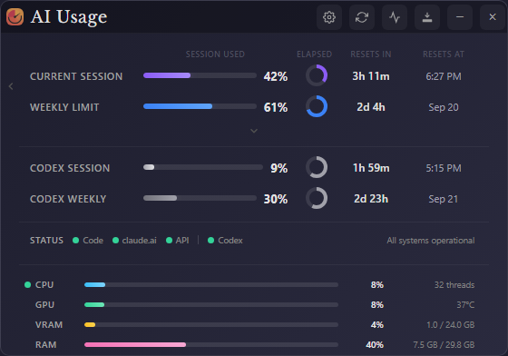
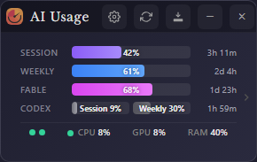

# AI Usage Widget

A desktop widget for **Windows** that shows your **Claude** and **OpenAI Codex** usage limits side by side — plus whether both services are up, and your PC's CPU, GPU and RAM.

> 🇰🇷 **한국어 안내는 [여기](#한국어-안내)** · [설치 파일 바로 받기](https://github.com/ijaehun/claude-usage-widget/releases/latest/download/Claude-Usage-Widget-1.7.6-win-Setup.exe)

Built on **[Claude Usage Widget](https://github.com/SlavomirDurej/claude-usage-widget) by Slavomir Durej** — thank you for making it and sharing it under the MIT license. See [Thanks](#thanks).



---

## Download

| File | Use |
| --- | --- |
| **[Claude-Usage-Widget-1.7.6-win-Setup.exe](https://github.com/ijaehun/claude-usage-widget/releases/latest/download/Claude-Usage-Widget-1.7.6-win-Setup.exe)** | Installer (recommended) |
| **[Claude-Usage-Widget-1.7.6-win-portable.exe](https://github.com/ijaehun/claude-usage-widget/releases/latest/download/Claude-Usage-Widget-1.7.6-win-portable.exe)** | Runs without installing |

Both links always point at the [latest release](../../releases/latest). The file names keep the original project's name and version so these links never change.

**First run**

1. The app isn't code-signed, so Windows SmartScreen warns. Click **More info → Run anyway**.
2. Choose what to track: **Claude**, **Codex**, or **both**.
3. **Claude:** log in with your own claude.ai account (Google sign-in works). If the login window gives you trouble, **Manual** lets you paste your session key instead.
   **Codex:** automatic if Codex is signed in on this PC; otherwise Settings → **Connect ChatGPT** signs in through your normal browser.

**Updating:** close the widget, run the new installer over the old one. Login and settings are kept.

---

## What it shows

- **Claude** — session (5-hour) and weekly limits, per-model weekly limits such as Fable, countdowns to each reset, a 7-day history graph, and desktop alerts at your thresholds.
- **Codex** — the same session and weekly limits, live from chatgpt.com, so use on other devices and the web counts too. Percentages are *used*, like Claude's.
- **Service status** — Claude Code, claude.ai and the Claude API; Codex CLI, VS Code extension, Web and API. Click the dot for details.
- **System** — CPU, GPU, VRAM and RAM (GPU on NVIDIA cards). Click the dot next to CPU for model, temperature, power and shared GPU memory.
- **Three views** — the widget, a compact view, or a thin bar docked to a screen edge that maximised windows stop at.
- **English or Korean** — follows your Windows language, or pick one in Settings.




---

## Tips

- **Track** in Settings switches between Claude, Codex or both at any time. The title follows: *AI Usage* for both.
- **Docked bar with no tray icon:** the button at the right end of the bar is the way back to the widget.
- **Hide from both the taskbar and the tray** while docked: turn **Hide from taskbar** on and **Show tray stats** off. While undocked, the taskbar button stays so the widget can't get lost.
- **Two Claude accounts:** start a second copy with `--profile=<name>` for its own login and settings.

---

## Privacy

- Your claude.ai session key and ChatGPT sign-in are stored **only on your PC**, encrypted with Windows' own protection.
- The app talks only to claude.ai, chatgpt.com / auth.openai.com (if you use Codex) and the public status pages (status.claude.com, status.openai.com).
- **Log out** clears the claude.ai session and the sign-in provider's cookies (Google, Apple, Microsoft).
- Usage comes from the same internal endpoints the Claude and ChatGPT websites use for your own account. There's no public usage API, so a site change can pause the numbers until the app is updated.

---

## Build from source

Needs [Git](https://git-scm.com) and [Node.js](https://nodejs.org) (LTS). Work **outside** Dropbox/OneDrive-style synced folders — the build fails inside them.

```bash
git clone https://github.com/ijaehun/claude-usage-widget.git
cd claude-usage-widget
npm ci
npm start           # run it
npm run build:win   # installer and portable .exe in dist\
```

---

## 한국어 안내

Claude와 Codex 사용량을 한눈에 보여주는 Windows용 위젯이에요. 두 서비스가 정상인지, 내 PC의 CPU·GPU·RAM 상태도 함께 보여줘요. 한국어 화면을 지원해요(Windows 언어가 한국어면 자동).

### 설치

1. **[설치 파일 받기](https://github.com/ijaehun/claude-usage-widget/releases/latest/download/Claude-Usage-Widget-1.7.6-win-Setup.exe)** (설치 없이 쓰려면 **[포터블 버전](https://github.com/ijaehun/claude-usage-widget/releases/latest/download/Claude-Usage-Widget-1.7.6-win-portable.exe)**)
2. 받은 파일을 실행해요. **"Windows의 PC 보호"** 경고가 뜨면 **추가 정보 → 실행**을 누르세요. 코드 서명이 없어서 뜨는 정상적인 경고예요.
3. 처음 실행하면 **무엇을 추적할지**(Claude / Codex / 둘 다) 골라요.
   - **Claude:** 로그인 창에서 본인 claude.ai 계정으로 로그인해요. 구글 로그인도 돼요. API 키는 필요 없어요.
   - **Codex:** 이 PC에 Codex가 로그인돼 있으면 자동이에요. 아니면 설정의 **ChatGPT 연결**을 누르면 평소 쓰는 브라우저에서 로그인할 수 있어요.

### 업데이트

자동 업데이트는 없어요. 새 버전이 나오면 **위젯을 종료한 뒤** 위 링크에서 다시 받아 설치하세요. 로그인과 설정은 그대로 유지돼요.

### 알아두면 좋은 것

- 설정의 **추적**에서 Claude / Codex / 둘 다를 언제든 바꿀 수 있어요.
- 상태 점(초록 점)을 누르면 서비스 상태를, CPU 옆 점을 누르면 시스템 정보를 자세히 볼 수 있어요.
- **화면 끝에 붙이기**를 켜면 화면 가장자리에 얇은 바로 고정돼요. 트레이 아이콘을 꺼 두었다면 바 오른쪽 끝 버튼이 위젯으로 돌아가는 방법이에요.
- 붙인 상태에서는 **작업 표시줄 숨김**을 켜고 **트레이에 표시**를 끄면 작업 표시줄과 트레이 양쪽에서 숨길 수 있어요.
- GPU·VRAM·온도는 **NVIDIA 그래픽카드**에서만 표시돼요.
- 사용량은 공식 API가 아니라 각 서비스 웹사이트가 내 계정에 쓰는 주소에서 읽어와요. 서비스가 바뀌면 표시가 잠시 멈출 수 있어요.

### 감사 인사

이 위젯은 **Slavomir Durej** 님의 **[Claude Usage Widget](https://github.com/SlavomirDurej/claude-usage-widget)** 을 바탕으로 만들었어요. 좋은 프로젝트를 만들고 MIT 라이선스로 공개해 주셔서 감사합니다.

---

## Thanks

This project exists because of **[Slavomir Durej](https://github.com/SlavomirDurej)**, who created [Claude Usage Widget](https://github.com/SlavomirDurej/claude-usage-widget) and released it under the MIT license. The login flow, the usage display, settings, compact mode and the history graph are his work and his contributors'. Thank you.

Contributors to the original project:

- [@cwil2072](https://github.com/cwil2072) — macOS minimize/restore fix, usage history graph
- [@dion-jy](https://github.com/dion-jy) — login flow architecture improvements
- [@goooseman](https://github.com/goooseman) — login window security improvements
- [@sergkuzn](https://github.com/sergkuzn) — Linux desktop launcher & autostart documentation
- [@Dolphin2ii](https://github.com/Dolphin2ii) — Electron/electron-builder security update
- [@torsten-liermann](https://github.com/torsten-liermann) — per-model weekly limit support (Fable)
- [@gastyg](https://github.com/gastyg) — Fable row for compact mode
- [@irishpolyglot](https://github.com/irishpolyglot) — Fable timer-pairing bug fix

For macOS and Linux, and for the original feature set, use the [original project](https://github.com/SlavomirDurej/claude-usage-widget).

---

## License

[MIT](LICENSE). The original copyright (© 2024 Slavomir Durej) is kept, as the license requires.
